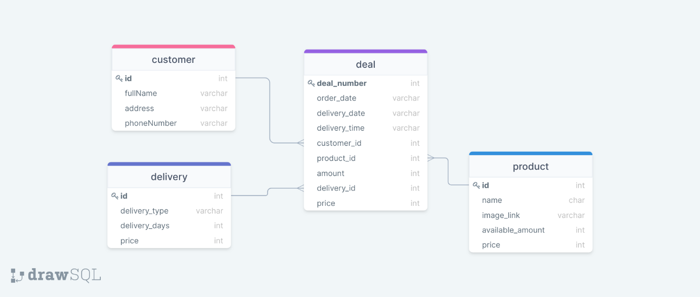

# Лабораторная работа - Piggie Market

## Предметная область – магазин свинок

**Пример работы**
https://user-images.githubusercontent.com/23421487/146004686-45e7903e-058a-452c-970e-cca659a5bd51.mp4

**Функциональные требования:**
* Хранение информации о заказах
* Хранение информации о покупателях
* Хранение информации о товаре
* Хранение информации о доставке
* Учитывать связь между заказом и покупателем
* Учитывать связь между заказом и товаром
* Учитывать связь между заказом и доставкой

**Все таблицы базы данных находятся в третьей нормальной форме:**
* База данных находится в первой нормальной форме, потому что хранимые значения максимально упрощены.
* База данных находится во второй нормальной форме, потому что существует первичный ключ, от которого зависят все неключевые атрибуты
* База данных находится в третьей нормальной форме, потому что нет зависимости одного неключевого атрибута от других (транзитивных зависимостей)

**Схема Базы Данных**

**Технологический стек**
* Angular
* Angular Material
* Nest.js
* TypeORM
* PostgreSQL
* Docker
